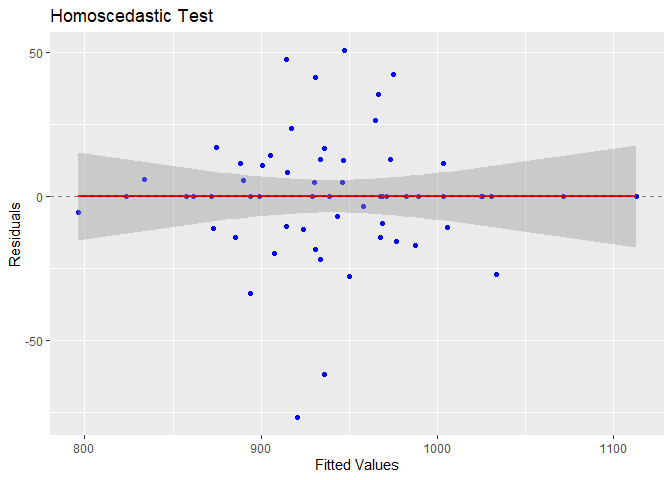

# Air Pollution Mortality Analysis


# Import Required Libraries

``` r
library(tidyverse)
library(skimr)
library(reshape)
library(hrbrthemes)
library(car)
library(lmtest)
library(MASS)

library(PulmoDataSets)
```

# Import Data

This data contains information from an early study exploring the
relationship between air pollution and mortality across 5 Standard
Metropolitan Statistical Areas in the U.S. between 1959 and 1961.

Check <https://lightbluetitan.github.io/pulmodatasets/index.html> for
more information.

``` r
data("air_polution_mortality_df")
df <- air_polution_mortality_df
df
```

                    City    Mort Precip Educ NonWhite NOX SO2
    1       San Jose, CA  790.73     13 12.2      3.0  32   3
    2        Wichita, KS  823.76     28 12.1      7.5   2   1
    3      San Diego, CA  839.71     10 12.1      5.9  66  20
    4      Lancaster, PA  844.05     43  9.5      2.9   7  32
    5    Minneapolis, MN  857.62     25 12.1      2.0  11  26
    6         Dallas, TX  860.10     35 11.8     14.8   1   1
    7          Miami, FL  861.44     60 11.5     13.5   1   1
    8    Los Angeles, CA  861.83     11 12.1      7.8 319 130
    9   Grand Rapids, MI  871.34     31 10.9      5.1   3  10
    10        Denver, CO  871.77     15 12.2      4.7   8  28
    11     Rochester, NY  874.28     32 11.1      5.0   4  18
    12      Hartford, CT  887.47     43 11.5      7.2   3  10
    13    Fort Worth, TX  891.71     31 11.4     11.5   1   1
    14      Portland, OR  893.99     37 12.0      3.6  21  44
    15     Worcester, MA  895.70     45 11.1      1.0   3   8
    16       Seattle, WA  899.26     35 12.2      5.7   7  20
    17    Bridgeport, CT  899.53     45 10.6      5.3   4   4
    18   Springfield, MA  904.16     45 11.1      3.4   4  20
    19 San Francisco, CA  911.70     18 12.2     13.7 171  86
    20          York, PA  911.82     42  9.0      4.8   8  49
    21         Utica, NY  912.20     40 10.3      2.5   2  11
    22        Canton, OH  912.35     36 10.7      6.7   7  20
    23   Kansas City, MO  919.73     35 12.0     12.6   4   4
    24         Akron, OH  921.87     36 11.4      8.8  15  59
    25     New Haven, CT  923.23     46 11.3      8.8   3   8
    26     Milwaukee, WI  929.15     30 11.1      5.8  23 125
    27        Boston, MA  934.70     43 12.1      3.5  32  62
    28        Dayton, OH  936.23     36 11.4     12.4   4  16
    29    Providence, RI  938.50     42 10.1      2.2   4  18
    30         Flint, MI  941.18     30 10.8     13.1   4  11
    31       Reading, PA  946.18     41  9.6      2.7  11  89
    32      Syracuse, NY  950.67     38 11.4      3.8   5  25
    33       Houston, TX  952.53     46 11.4     21.0   5   1
    34   Saint Louis, MO  953.56     34  9.7     17.2  15  68
    35    Youngstown, OH  954.44     38 10.7     11.7  13  39
    36      Columbus, OH  958.84     37 11.9     13.1   9  15
    37       Detroit, MI  959.22     31 10.8     15.8  35 124
    38     Nashville, TN  961.01     45 10.1     21.0  14  78
    39     Allentown, PA  962.35     44  9.8      0.8   6  33
    40    Washington, DC  967.80     41 12.3     25.9  28 102
    41  Indianapolis, IN  968.66     39 11.4     15.6   7  33
    42    Cincinnati, OH  970.47     40 10.2     13.0  26 146
    43   Greeensboro, NC  971.12     42 10.4     22.7   3   5
    44        Toledo, OH  972.46     31 10.7      9.5   7  25
    45       Atlanta, GA  982.29     47 11.1     27.1   8  24
    46     Cleveland, OH  985.95     35 11.1     14.7  21  64
    47    Louisville, KY  989.27     30  9.9     13.1  37 193
    48    Pittsburgh, PA  991.29     36 10.6      8.1  59 263
    49      New York, NY  994.65     42 10.7     11.3  26 108
    50        Albany, NY  997.88     35 11.0      3.5  10  39
    51       Buffalo, NY 1001.90     36 10.5      8.1  12  37
    52    Wilmington, DE 1003.50     45 11.3     12.1  11  42
    53       Memphis, TN 1006.49     50 10.4     36.7  18  34
    54  Philadelphia, PA 1015.02     42 10.5     17.5  32 161
    55   Chattanooga, TN 1017.61     52  9.6     22.2   8  27
    56       Chicago, IL 1024.89     33 10.9     16.3  63 278
    57      Richmond, VA 1025.50     44 11.0     28.6   9  48
    58    Birmingham, AL 1030.38     53 10.2     38.5  32  72
    59     Baltimore, MD 1071.29     43  9.6     24.4  38 206
    60   New Orleans, LA 1113.06     54  9.7     31.4  17   1

# Exploratory Data Analysis

I assume that *City* won’t be necessary and dropped in this stage since
it is a unique and a categorical/factor variable. However, as each city
has its non-unique states, it will still be considered later.

## Quick Summary

``` r
df_num <- df[,-1]

skim(df_num)
```

|                                                  |        |
|:-------------------------------------------------|:-------|
| Name                                             | df_num |
| Number of rows                                   | 60     |
| Number of columns                                | 6      |
| \_\_\_\_\_\_\_\_\_\_\_\_\_\_\_\_\_\_\_\_\_\_\_   |        |
| Column type frequency:                           |        |
| numeric                                          | 6      |
| \_\_\_\_\_\_\_\_\_\_\_\_\_\_\_\_\_\_\_\_\_\_\_\_ |        |
| Group variables                                  | None   |

Data summary

**Variable type: numeric**

| skim_variable | n_missing | complete_rate | mean | sd | p0 | p25 | p50 | p75 | p100 | hist |
|:---|---:|---:|---:|---:|---:|---:|---:|---:|---:|:---|
| Mort | 0 | 1 | 940.36 | 62.20 | 790.73 | 898.37 | 943.68 | 983.20 | 1113.06 | \<U+2582\>\<U+2586\>\<U+2587\>\<U+2585\>\<U+2581\> |
| Precip | 0 | 1 | 37.37 | 9.98 | 10.00 | 32.75 | 38.00 | 43.25 | 60.00 | \<U+2582\>\<U+2582\>\<U+2587\>\<U+2587\>\<U+2581\> |
| Educ | 0 | 1 | 10.97 | 0.85 | 9.00 | 10.40 | 11.05 | 11.50 | 12.30 | \<U+2582\>\<U+2583\>\<U+2586\>\<U+2587\>\<U+2586\> |
| NonWhite | 0 | 1 | 11.87 | 8.92 | 0.80 | 4.95 | 10.40 | 15.65 | 38.50 | \<U+2587\>\<U+2586\>\<U+2582\>\<U+2581\>\<U+2581\> |
| NOX | 0 | 1 | 22.65 | 46.33 | 1.00 | 4.00 | 9.00 | 23.75 | 319.00 | \<U+2587\>\<U+2581\>\<U+2581\>\<U+2581\>\<U+2581\> |
| SO2 | 0 | 1 | 53.77 | 63.39 | 1.00 | 11.00 | 30.00 | 69.00 | 278.00 | \<U+2587\>\<U+2582\>\<U+2581\>\<U+2581\>\<U+2581\> |

## Histogram

``` r
par(mfrow = c(2,3))

for (col in colnames(df_num)){
  hist(df_num[[col]], freq = F, breaks = 13, xlab = col, main = paste('Dist of', col), col = 'lightblue')
  lines(density(df_num[[col]]), col = 'blue', lwd = 2)
}
```


Each variable’s, except for *NOX*, distribution seems quite reasonable
and satisfies the assumption of a regression that *There must be
sufficient variation in the values of X variables*. Although *SO2*
appears to be heavily skewed, its values still vary between 50-250. NOX,
on the other hand, are lies almost entirely between 0 and 50, with only
few points outside of this range.

I suppose that *NOX* won’t give significant effect in the model. But
we’ll see.

## Scatter Plot

``` r
pairs(df_num,
      col = 'blue',
      gap = 0,
      )
```


It is apparent that the effect of *NOX* on *Mort* appears to be
completely random – might still be slightly correlated though.

This graph gives me a suspicion of nonlinear link between *SO2* and
*City*. I will perform a certain transformation on the variable to
reveal this nonlinear relationship.

## Correlation Heatmap

``` r
corr <- melt(cor(df_num, method = "pearson"), as.is = TRUE)

ggplot(corr, aes(x = X1, y = X2, fill = value)) + 
  geom_tile() + 
  scale_fill_distiller(palette = 'RdBu', limit = c(-1,1)) + 
  geom_text(aes(label = round(value, 2)), col = 'black', size = 4) + 
  labs(title = 'Variables Correlation', x = '', y = '')
```


As I assumed previously, *NOX* is barely correlated with *Mort*, with
only -0.08 of correlation coefficient. I also thought of a nonlinear
correlation between *SO2* and *Mort*. To capture their connection more
accurately, I am considering on using Spearman method to assess it.

``` r
cor(df_num$SO2, df_num$Mort, method = 'spearman')
```

    [1] 0.4905252

Apparently, It doesn’t remarkably differ with the Pearson method, yet
still give a moderate correlation coefficient.

# Modeling

Since the data only contains numeric variables and the dependent
variable is a continuous variable, this will be an easy regression
analysis. The analysis will be conducted using backward elimination
method. I will rely on the statistical test, such as t-test, to
eliminate insignificant variables. However, in the later section, I will
also consider to retain insignificant variable based on prior evidence
and/or domain knowledge.

## First Model

``` r
model1 <- lm(Mort ~ ., data = df_num)
summary(model1)
```


    Call:
    lm(formula = Mort ~ ., data = df_num)

    Residuals:
        Min      1Q  Median      3Q     Max 
    -91.893 -18.986  -3.433  15.872  91.528 

    Coefficients:
                 Estimate Std. Error t value Pr(>|t|)    
    (Intercept) 1000.1026    92.3982  10.824 3.85e-15 ***
    Precip         1.3792     0.7000   1.970 0.053943 .  
    Educ         -15.0791     7.0706  -2.133 0.037518 *  
    NonWhite       3.1602     0.6287   5.026 5.84e-06 ***
    NOX           -0.1076     0.1359  -0.792 0.432030    
    SO2            0.3554     0.0914   3.889 0.000278 ***
    ---
    Signif. codes:  0 '***' 0.001 '**' 0.01 '*' 0.05 '.' 0.1 ' ' 1

    Residual standard error: 37.36 on 54 degrees of freedom
    Multiple R-squared:  0.6698,    Adjusted R-squared:  0.6392 
    F-statistic:  21.9 on 5 and 54 DF,  p-value: 6.478e-12

A pretty decent starting model, with the R-squared value of 0.6392.
Next, I will transform *SO2* with *log* transformation to reveal the
nonlinear effect.

## Second Model

``` r
model2 <- lm(Mort ~ Precip + Educ + NonWhite + NOX + log(SO2), data = df_num)
summary(model2)
```


    Call:
    lm(formula = Mort ~ Precip + Educ + NonWhite + NOX + log(SO2), 
        data = df_num)

    Residuals:
        Min      1Q  Median      3Q     Max 
    -98.988 -19.940   1.057  17.499 115.431 

    Coefficients:
                 Estimate Std. Error t value Pr(>|t|)    
    (Intercept) 944.17471   94.17758  10.025 6.25e-14 ***
    Precip        1.42242    0.68221   2.085   0.0418 *  
    Educ        -13.35817    6.95943  -1.919   0.0602 .  
    NonWhite      3.43512    0.60693   5.660 5.95e-07 ***
    NOX          -0.09677    0.12989  -0.745   0.4595    
    log(SO2)     15.96124    3.67450   4.344 6.21e-05 ***
    ---
    Signif. codes:  0 '***' 0.001 '**' 0.01 '*' 0.05 '.' 0.1 ' ' 1

    Residual standard error: 36.39 on 54 degrees of freedom
    Multiple R-squared:  0.6867,    Adjusted R-squared:  0.6577 
    F-statistic: 23.68 on 5 and 54 DF,  p-value: 1.615e-12

It can be seen that *log SO2* results in a higher coefficient and higher
Adjusted R-squared of the model. From this point onward, I will use *log
SO2* in the model.

## Third Model

To give a better perspective on how each variable influences the
dependent variable, I transform the variables to a standardised form.
Standardisation on regression is basically the same as regular
regression with a transformation of *k = 1/var(X)*. Hence, by its
statistical properties, the R-squared remain the same as the regular
form, but with a better interpretation of the *beta* coefficient.

``` r
df_num$log_SO2 <- log(df_num$SO2)
df_scaled2 <- as.data.frame(scale(df_num))
df_scaled2 <- subset(df_scaled2, select = -c(SO2))

model_scaled<- lm(Mort ~ Precip + Educ + NonWhite + NOX + log_SO2, data = df_scaled2)
summary(model_scaled)
```


    Call:
    lm(formula = Mort ~ Precip + Educ + NonWhite + NOX + log_SO2, 
        data = df_scaled2)

    Residuals:
         Min       1Q   Median       3Q      Max 
    -1.59140 -0.32056  0.01699  0.28132  1.85575 

    Coefficients:
                  Estimate Std. Error t value Pr(>|t|)    
    (Intercept)  6.767e-16  7.553e-02   0.000   1.0000    
    Precip       2.283e-01  1.095e-01   2.085   0.0418 *  
    Educ        -1.815e-01  9.458e-02  -1.919   0.0602 .  
    NonWhite     4.927e-01  8.705e-02   5.660 5.95e-07 ***
    NOX         -7.208e-02  9.676e-02  -0.745   0.4595    
    log_SO2      3.843e-01  8.847e-02   4.344 6.21e-05 ***
    ---
    Signif. codes:  0 '***' 0.001 '**' 0.01 '*' 0.05 '.' 0.1 ' ' 1

    Residual standard error: 0.585 on 54 degrees of freedom
    Multiple R-squared:  0.6867,    Adjusted R-squared:  0.6577 
    F-statistic: 23.68 on 5 and 54 DF,  p-value: 1.615e-12

As we can see, the Adjusted R-squared remain consistent while the *beta*
coefficient is transformed. Here, the model shows that *NOX* has a small
influence on *Mort* by less than 0.1 of. *beta* coefficient. Therefore,
I drop the variable to look for a better fit.

``` r
model3 <- lm(Mort ~ Precip + Educ + NonWhite + log_SO2, data = df_scaled2)
summary(model3)
```


    Call:
    lm(formula = Mort ~ Precip + Educ + NonWhite + log_SO2, data = df_scaled2)

    Residuals:
         Min       1Q   Median       3Q      Max 
    -1.61353 -0.36244 -0.01152  0.30893  1.78077 

    Coefficients:
                  Estimate Std. Error t value Pr(>|t|)    
    (Intercept)  6.881e-16  7.522e-02   0.000  1.00000    
    Precip       2.634e-01  9.847e-02   2.675  0.00982 ** 
    Educ        -1.898e-01  9.355e-02  -2.028  0.04736 *  
    NonWhite     4.763e-01  8.390e-02   5.678 5.31e-07 ***
    log_SO2      3.615e-01  8.266e-02   4.373 5.50e-05 ***
    ---
    Signif. codes:  0 '***' 0.001 '**' 0.01 '*' 0.05 '.' 0.1 ' ' 1

    Residual standard error: 0.5827 on 55 degrees of freedom
    Multiple R-squared:  0.6835,    Adjusted R-squared:  0.6605 
    F-statistic:  29.7 on 4 and 55 DF,  p-value: 3.599e-13

Dropping *NOX* apparently leads to a better fit of the model – shown by
bigger Adjusted R-Squared.

``` r
model_unscaled <- lm(Mort ~ Precip + Educ + NonWhite + log(SO2), data = df_num)
summary(model_unscaled)
```


    Call:
    lm(formula = Mort ~ Precip + Educ + NonWhite + log(SO2), data = df_num)

    Residuals:
         Min       1Q   Median       3Q      Max 
    -100.364  -22.544   -0.716   19.216  110.767 

    Coefficients:
                Estimate Std. Error t value Pr(>|t|)    
    (Intercept) 944.8448    93.7916  10.074 4.28e-14 ***
    Precip        1.6410     0.6134   2.675  0.00982 ** 
    Educ        -13.9637     6.8838  -2.028  0.04736 *  
    NonWhite      3.3212     0.5850   5.678 5.31e-07 ***
    log(SO2)     15.0134     3.4333   4.373 5.50e-05 ***
    ---
    Signif. codes:  0 '***' 0.001 '**' 0.01 '*' 0.05 '.' 0.1 ' ' 1

    Residual standard error: 36.24 on 55 degrees of freedom
    Multiple R-squared:  0.6835,    Adjusted R-squared:  0.6605 
    F-statistic:  29.7 on 4 and 55 DF,  p-value: 3.599e-13

Moreover, All of the variables satisfy the significance requirement
(*beta ≠ 0*), as reflected by p-values \< 0.05.

# Dummy Modeling

An Adjusted R-Squared of 0.6605 is quite acceptable, but I think it
could be improved.

In the previous stage, I didn’t consider *City* as an explanatory
variable as it is a unique factor. However, some cities shared same
States that could be regarded as a covariate.

``` r
df$Location <- sub(".*,\\s*", "", df$City)
df2 <- subset(df, select = -c(City))
df2
```

          Mort Precip Educ NonWhite NOX SO2 Location
    1   790.73     13 12.2      3.0  32   3       CA
    2   823.76     28 12.1      7.5   2   1       KS
    3   839.71     10 12.1      5.9  66  20       CA
    4   844.05     43  9.5      2.9   7  32       PA
    5   857.62     25 12.1      2.0  11  26       MN
    6   860.10     35 11.8     14.8   1   1       TX
    7   861.44     60 11.5     13.5   1   1       FL
    8   861.83     11 12.1      7.8 319 130       CA
    9   871.34     31 10.9      5.1   3  10       MI
    10  871.77     15 12.2      4.7   8  28       CO
    11  874.28     32 11.1      5.0   4  18       NY
    12  887.47     43 11.5      7.2   3  10       CT
    13  891.71     31 11.4     11.5   1   1       TX
    14  893.99     37 12.0      3.6  21  44       OR
    15  895.70     45 11.1      1.0   3   8       MA
    16  899.26     35 12.2      5.7   7  20       WA
    17  899.53     45 10.6      5.3   4   4       CT
    18  904.16     45 11.1      3.4   4  20       MA
    19  911.70     18 12.2     13.7 171  86       CA
    20  911.82     42  9.0      4.8   8  49       PA
    21  912.20     40 10.3      2.5   2  11       NY
    22  912.35     36 10.7      6.7   7  20       OH
    23  919.73     35 12.0     12.6   4   4       MO
    24  921.87     36 11.4      8.8  15  59       OH
    25  923.23     46 11.3      8.8   3   8       CT
    26  929.15     30 11.1      5.8  23 125       WI
    27  934.70     43 12.1      3.5  32  62       MA
    28  936.23     36 11.4     12.4   4  16       OH
    29  938.50     42 10.1      2.2   4  18       RI
    30  941.18     30 10.8     13.1   4  11       MI
    31  946.18     41  9.6      2.7  11  89       PA
    32  950.67     38 11.4      3.8   5  25       NY
    33  952.53     46 11.4     21.0   5   1       TX
    34  953.56     34  9.7     17.2  15  68       MO
    35  954.44     38 10.7     11.7  13  39       OH
    36  958.84     37 11.9     13.1   9  15       OH
    37  959.22     31 10.8     15.8  35 124       MI
    38  961.01     45 10.1     21.0  14  78       TN
    39  962.35     44  9.8      0.8   6  33       PA
    40  967.80     41 12.3     25.9  28 102       DC
    41  968.66     39 11.4     15.6   7  33       IN
    42  970.47     40 10.2     13.0  26 146       OH
    43  971.12     42 10.4     22.7   3   5       NC
    44  972.46     31 10.7      9.5   7  25       OH
    45  982.29     47 11.1     27.1   8  24       GA
    46  985.95     35 11.1     14.7  21  64       OH
    47  989.27     30  9.9     13.1  37 193       KY
    48  991.29     36 10.6      8.1  59 263       PA
    49  994.65     42 10.7     11.3  26 108       NY
    50  997.88     35 11.0      3.5  10  39       NY
    51 1001.90     36 10.5      8.1  12  37       NY
    52 1003.50     45 11.3     12.1  11  42       DE
    53 1006.49     50 10.4     36.7  18  34       TN
    54 1015.02     42 10.5     17.5  32 161       PA
    55 1017.61     52  9.6     22.2   8  27       TN
    56 1024.89     33 10.9     16.3  63 278       IL
    57 1025.50     44 11.0     28.6   9  48       VA
    58 1030.38     53 10.2     38.5  32  72       AL
    59 1071.29     43  9.6     24.4  38 206       MD
    60 1113.06     54  9.7     31.4  17   1       LA

## Quick EDA

Do different states mean different Mortality Rate?

``` r
df$Location <- sub(".*,\\s*", "", df$City)
df2 <- subset(df, select = -c(City))

grouped = df2 %>% group_by(Location) %>% 
  summarise(Avg = mean(Mort), Var = var(Mort))

ggplot(df2, aes(x = Location, y = Mort)) + 
  geom_boxplot() + geom_jitter(position = 'identity')
```


To ensure that the differences are real, let’s use a statistical test.
Although ANOVA is the standard method to evaluate the presence of
differences, it assumes the same variance between group, which is not
satisfied in this data (some group contain only 1 observation, resulting
in NA variance). Thus, I will perform Kruskal-Wallis test as an
alternative to ANOVA.

``` r
kruskal.test(Mort ~ Location, data = df2)
```


        Kruskal-Wallis rank sum test

    data:  Mort by Location
    Kruskal-Wallis chi-squared = 42.05, df = 28, p-value = 0.04289

The result shows that there is at least one group that differ from the
other. Hence, *Location* might have a significant effect towards *Mort.*

We still have to be aware whether *Location* also affect, or at least
correlated, other explanatory variables or not. I will reveal its effect
towards the others later in the multicollinearity test.

## First Model

I will continue to use the standardised model to provide a better
insight into the true effect of the predictors on the dependent
variable. I will also modify the reference category of the categorical
variable, using the category with the highest *Mort* as the reference,
to see which states truly differ from it

``` r
df_scaled2 <- cbind(df_scaled2, df2$Location)
colnames(df_scaled2)[7] <- 'Location'

df_scaled2$Location <- df_scaled2$Location %>% 
  factor() %>% 
  relevel(ref = 'LA')
```

Move on to the first model with dummy variable. Since the third model in
the latest stage has been proven to be the best model – all variables
are statistically significant and generates quiet high Adjusted
R-squared – I will start the first dummy model with the corresponding
regressors.

``` r
dummy1 <- lm(Mort ~ Precip + Educ + NonWhite + log_SO2 + Location, data = df_scaled2)
summary(dummy1)
```


    Call:
    lm(formula = Mort ~ Precip + Educ + NonWhite + log_SO2 + Location, 
        data = df_scaled2)

    Residuals:
        Min      1Q  Median      3Q     Max 
    -1.2125 -0.1368  0.0000  0.1277  0.7939 

    Coefficients:
                Estimate Std. Error t value Pr(>|t|)   
    (Intercept)  2.13182    0.96259   2.215  0.03541 * 
    Precip       0.30615    0.31509   0.972  0.33987   
    Educ         0.08694    0.15989   0.544  0.59106   
    NonWhite     0.52419    0.24066   2.178  0.03830 * 
    log_SO2      0.41309    0.16829   2.455  0.02083 * 
    LocationAL  -2.94682    0.84158  -3.502  0.00163 **
    LocationCA  -2.73476    1.39852  -1.955  0.06095 . 
    LocationCO  -2.29077    1.46662  -1.562  0.12995   
    LocationCT  -2.33427    1.02642  -2.274  0.03112 * 
    LocationDC  -3.15667    1.09658  -2.879  0.00772 **
    LocationDE  -1.54692    1.15217  -1.343  0.19058   
    LocationFL  -3.36256    1.07574  -3.126  0.00421 **
    LocationGA  -2.65567    0.89660  -2.962  0.00631 **
    LocationIL  -1.56206    1.20458  -1.297  0.20569   
    LocationIN  -2.07248    1.08085  -1.917  0.06582 . 
    LocationKS  -2.69632    1.15044  -2.344  0.02670 * 
    LocationKY  -1.65118    1.20713  -1.368  0.18263   
    LocationMA  -2.27781    1.22155  -1.865  0.07313 . 
    LocationMD  -1.38226    0.99699  -1.386  0.17696   
    LocationMI  -2.13829    1.05082  -2.035  0.05179 . 
    LocationMN  -2.63550    1.38410  -1.904  0.06760 . 
    LocationMO  -2.16018    0.97402  -2.218  0.03517 * 
    LocationNC  -1.91873    0.84366  -2.274  0.03111 * 
    LocationNY  -1.56797    1.09837  -1.428  0.16489   
    LocationOH  -1.98371    1.02249  -1.940  0.06288 . 
    LocationOR  -2.64757    1.34663  -1.966  0.05965 . 
    LocationPA  -2.03577    1.10138  -1.848  0.07553 . 
    LocationRI  -1.56108    1.18443  -1.318  0.19858   
    LocationTN  -2.52616    0.77034  -3.279  0.00287 **
    LocationTX  -2.16100    0.84678  -2.552  0.01668 * 
    LocationVA  -2.13805    0.91811  -2.329  0.02760 * 
    LocationWA  -2.42800    1.27640  -1.902  0.06786 . 
    LocationWI  -2.19239    1.32599  -1.653  0.10983   
    ---
    Signif. codes:  0 '***' 0.001 '**' 0.01 '*' 0.05 '.' 0.1 ' ' 1

    Residual standard error: 0.5144 on 27 degrees of freedom
    Multiple R-squared:  0.8789,    Adjusted R-squared:  0.7354 
    F-statistic: 6.125 on 32 and 27 DF,  p-value: 3.794e-06

## Second Model

The previous model is generally good, since it improved the Adjusted
R-squared from 0.6605 to 0.7354. However, it might still be improved as
the model contains many insignificant variables.

In the second model, I drop *Educ* as it only affect *Mort* by 0.08 of
*Mort* standard deviation. I also don’t think that Education directly
influence a city’s mortality rate. (Might be a bit biased on this :D)

``` r
dummy2 <- lm(Mort ~ Precip + NonWhite + log_SO2 + Location, data = df_scaled2)
summary(dummy2)
```


    Call:
    lm(formula = Mort ~ Precip + NonWhite + log_SO2 + Location, data = df_scaled2)

    Residuals:
        Min      1Q  Median      3Q     Max 
    -1.2344 -0.1680  0.0000  0.1775  0.8145 

    Coefficients:
                Estimate Std. Error t value Pr(>|t|)   
    (Intercept)   1.9394     0.8839   2.194  0.03668 * 
    Precip        0.2484     0.2929   0.848  0.40362   
    NonWhite      0.5718     0.2213   2.584  0.01527 * 
    log_SO2       0.3881     0.1598   2.428  0.02186 * 
    LocationAL   -2.8677     0.8184  -3.504  0.00156 **
    LocationCA   -2.5369     1.3333  -1.903  0.06740 . 
    LocationCO   -2.0611     1.3867  -1.486  0.14837   
    LocationCT   -2.0790     0.9012  -2.307  0.02867 * 
    LocationDC   -2.8579     0.9370  -3.050  0.00496 **
    LocationDE   -1.2690     1.0195  -1.245  0.22356   
    LocationFL   -3.0471     0.8944  -3.407  0.00201 **
    LocationGA   -2.4762     0.8231  -3.008  0.00550 **
    LocationIL   -1.3856     1.1454  -1.210  0.23649   
    LocationIN   -1.8417     0.9814  -1.876  0.07105 . 
    LocationKS   -2.4723     1.0605  -2.331  0.02717 * 
    LocationKY   -1.5839     1.1856  -1.336  0.19231   
    LocationMA   -1.9506     1.0496  -1.858  0.07365 . 
    LocationMD   -1.3299     0.9798  -1.357  0.18551   
    LocationMI   -1.9966     1.0051  -1.986  0.05685 . 
    LocationMN   -2.3451     1.2607  -1.860  0.07341 . 
    LocationMO   -2.0198     0.9273  -2.178  0.03797 * 
    LocationNC   -1.8428     0.8215  -2.243  0.03298 * 
    LocationNY   -1.3546     1.0129  -1.337  0.19187   
    LocationOH   -1.7848     0.9428  -1.893  0.06871 . 
    LocationOR   -2.2977     1.1680  -1.967  0.05914 . 
    LocationPA   -1.8881     1.0539  -1.792  0.08401 . 
    LocationRI   -1.3852     1.1250  -1.231  0.22846   
    LocationTN   -2.4332     0.7416  -3.281  0.00277 **
    LocationTX   -1.9854     0.7729  -2.569  0.01582 * 
    LocationVA   -1.9827     0.8615  -2.302  0.02901 * 
    LocationWA   -2.0935     1.1043  -1.896  0.06834 . 
    LocationWI   -1.9700     1.2454  -1.582  0.12492   
    ---
    Signif. codes:  0 '***' 0.001 '**' 0.01 '*' 0.05 '.' 0.1 ' ' 1

    Residual standard error: 0.5078 on 28 degrees of freedom
    Multiple R-squared:  0.8776,    Adjusted R-squared:  0.7421 
    F-statistic: 6.476 on 31 and 28 DF,  p-value: 1.646e-06

Although the Adjusted R-squared increased, it only rose by barely 0.07

## Third Model

``` r
dummy3 <- lm(Mort ~ NonWhite + log_SO2 + Location, data = df_scaled2)
summary(dummy3)
```


    Call:
    lm(formula = Mort ~ NonWhite + log_SO2 + Location, data = df_scaled2)

    Residuals:
        Min      1Q  Median      3Q     Max 
    -1.1850 -0.1499  0.0000  0.1517  0.8600 

    Coefficients:
                Estimate Std. Error t value Pr(>|t|)   
    (Intercept)   2.1453     0.8458   2.537  0.01684 * 
    NonWhite      0.6391     0.2056   3.109  0.00418 **
    log_SO2       0.3597     0.1555   2.313  0.02803 * 
    LocationAL   -2.8651     0.8144  -3.518  0.00145 **
    LocationCA   -3.3137     0.9641  -3.437  0.00180 **
    LocationCO   -2.7667     1.1040  -2.506  0.01807 * 
    LocationCT   -2.0914     0.8967  -2.332  0.02683 * 
    LocationDC   -3.0522     0.9042  -3.376  0.00211 **
    LocationDE   -1.2764     1.0145  -1.258  0.21836   
    LocationFL   -2.7628     0.8252  -3.348  0.00227 **
    LocationGA   -2.5576     0.8135  -3.144  0.00383 **
    LocationIL   -1.6874     1.0834  -1.558  0.13018   
    LocationIN   -2.0294     0.9515  -2.133  0.04154 * 
    LocationKS   -2.9387     0.9023  -3.257  0.00287 **
    LocationKY   -1.9432     1.1019  -1.763  0.08837 . 
    LocationMA   -1.9160     1.0437  -1.836  0.07667 . 
    LocationMD   -1.4498     0.9648  -1.503  0.14375   
    LocationMI   -2.3655     0.9017  -2.623  0.01373 * 
    LocationMN   -2.7829     1.1445  -2.431  0.02145 * 
    LocationMO   -2.3273     0.8493  -2.740  0.01040 * 
    LocationNC   -2.0452     0.7823  -2.615  0.01403 * 
    LocationNY   -1.5149     0.9903  -1.530  0.13692   
    LocationOH   -2.0097     0.9003  -2.232  0.03349 * 
    LocationOR   -2.4392     1.1504  -2.120  0.04266 * 
    LocationPA   -1.9305     1.0476  -1.843  0.07560 . 
    LocationRI   -1.4087     1.1192  -1.259  0.21819   
    LocationTN   -2.4510     0.7377  -3.322  0.00242 **
    LocationTX   -2.2820     0.6858  -3.328  0.00239 **
    LocationVA   -2.1369     0.8379  -2.550  0.01631 * 
    LocationWA   -2.3156     1.0676  -2.169  0.03842 * 
    LocationWI   -2.2824     1.1838  -1.928  0.06371 . 
    ---
    Signif. codes:  0 '***' 0.001 '**' 0.01 '*' 0.05 '.' 0.1 ' ' 1

    Residual standard error: 0.5054 on 29 degrees of freedom
    Multiple R-squared:  0.8745,    Adjusted R-squared:  0.7446 
    F-statistic: 6.734 on 30 and 29 DF,  p-value: 8.394e-07

Lastly, I dropped *Precip* since it is also statistically insignificant
towards the model. By dropping it, the model generates slightly higher
Adjusted R-squared.

I think this model is already a good fit, even though some of the
dummies are still statistically insignificant.

# Final Model

As I stated in the **Modeling** Section, I won’t solely rely on the
statistical properties but some domain knowledge as well. I might also
consider existing evidences and combine it with the statistical
properties.

In this case, I still want to include *Precip* into the model because
some researches have said that precipitation, and heavy rain, do
associates with mortality risk and poses health risks.

On the other side, *Educ* could have been a reasonable variable to be
included as well. Several studies have shown a connection between
mortality and education, concluding that education is one of the key
factor in reducing mortality risk. However, this conclusion isn’t
well-reflected in this analysis. In the first dummy model *dummy1*,
*Educ* has a positive link with *Mort*, implying that higher median
years of education are linked to a higher mortality rate, which is the
opposite of the findings from previous research. Therefore, I will not
include *Educ* into the final model

Thus, the second dummy model *dummy2* would be the final model and will
be tested whether it satisfies the classic linear regression
assumptions. The model below is the unscaled model, which will be testes
afterwards.

``` r
df2$Location <- df2$Location %>% 
  factor() %>% 
  relevel(ref = 'LA')

dummy_unscaled <- lm(Mort ~ Precip + NonWhite + log(SO2) + Location, data = df2)
summary(dummy_unscaled)
```


    Call:
    lm(formula = Mort ~ Precip + NonWhite + log(SO2) + Location, 
        data = df2)

    Residuals:
       Min     1Q Median     3Q    Max 
    -76.78 -10.45   0.00  11.04  50.66 

    Coefficients:
                Estimate Std. Error t value Pr(>|t|)    
    (Intercept)  904.313     98.130   9.215 5.66e-10 ***
    Precip         1.547      1.825   0.848  0.40362    
    NonWhite       3.987      1.543   2.584  0.01527 *  
    log(SO2)      16.119      6.639   2.428  0.02186 *  
    LocationAL  -178.378     50.907  -3.504  0.00156 ** 
    LocationCA  -157.802     82.932  -1.903  0.06740 .  
    LocationCO  -128.204     86.256  -1.486  0.14837    
    LocationCT  -129.315     56.056  -2.307  0.02867 *  
    LocationDC  -177.768     58.283  -3.050  0.00496 ** 
    LocationDE   -78.932     63.415  -1.245  0.22356    
    LocationFL  -189.534     55.634  -3.407  0.00201 ** 
    LocationGA  -154.023     51.197  -3.008  0.00550 ** 
    LocationIL   -86.186     71.243  -1.210  0.23649    
    LocationIN  -114.556     61.048  -1.876  0.07105 .  
    LocationKS  -153.779     65.966  -2.331  0.02717 *  
    LocationKY   -98.523     73.745  -1.336  0.19231    
    LocationMA  -121.332     65.288  -1.858  0.07365 .  
    LocationMD   -82.722     60.944  -1.357  0.18551    
    LocationMI  -124.192     62.520  -1.986  0.05685 .  
    LocationMN  -145.867     78.419  -1.860  0.07341 .  
    LocationMO  -125.637     57.681  -2.178  0.03797 *  
    LocationNC  -114.628     51.099  -2.243  0.03298 *  
    LocationNY   -84.259     63.005  -1.337  0.19187    
    LocationOH  -111.020     58.641  -1.893  0.06871 .  
    LocationOR  -142.923     72.654  -1.967  0.05914 .  
    LocationPA  -117.442     65.552  -1.792  0.08401 .  
    LocationRI   -86.160     69.975  -1.231  0.22846    
    LocationTN  -151.347     46.129  -3.281  0.00277 ** 
    LocationTX  -123.494     48.073  -2.569  0.01582 *  
    LocationVA  -123.325     53.584  -2.302  0.02901 *  
    LocationWA  -130.222     68.688  -1.896  0.06834 .  
    LocationWI  -122.535     77.463  -1.582  0.12492    
    ---
    Signif. codes:  0 '***' 0.001 '**' 0.01 '*' 0.05 '.' 0.1 ' ' 1

    Residual standard error: 31.59 on 28 degrees of freedom
    Multiple R-squared:  0.8776,    Adjusted R-squared:  0.7421 
    F-statistic: 6.476 on 31 and 28 DF,  p-value: 1.646e-06

# Assumptions

## Linearity

As the name suggests, Linear Regression is a formula that expresses the
conditional expectation of *Y* as a linear function of *X*. However, the
term “linear” here refers to linearity in the parameters, which allows
the transformation of *X* variables using any of nonlinear function,
such as *log(SO2)* in the prior stages.

This model certainly pass this assumption.

## Exogeneity

This assumption states that *Covariance, or Correlation, between
independent variables and errors should be zero*.

``` r
X_resid <- data.frame(Residual = dummy_unscaled$resid, Precip = df2$Precip, NonWhite = df2$NonWhite, log_SO2 = log(df2$SO2))

cor(X_resid)
```

                  Residual        Precip      NonWhite       log_SO2
    Residual  1.000000e+00 -2.734472e-17 -3.658546e-17 -4.615482e-17
    Precip   -2.734472e-17  1.000000e+00  4.132045e-01 -1.211723e-01
    NonWhite -3.658546e-17  4.132045e-01  1.000000e+00  5.240924e-02
    log_SO2  -4.615482e-17 -1.211723e-01  5.240924e-02  1.000000e+00

Though a simple correlation coefficient test doesn’t guarantee their
independence, a low correlation coefficient might indicates that they
would satisfy the assumption.

## Zero Mean

The errors should be averaged at 0 for any given X. The plot below shows
that given *Precip, NonWhite,* and *log(SO2)* the residuals are centered
around 0. Thus, it satisfy this assumption.

``` r
pairs(X_resid)
```


## Homoscedastic

The variance of the errors should also be constant for any given X. This
assumption can be evaluated by plotting the fitted values against the
residuals or by using statistical test such as Breusch-Pagan test.

``` r
fit_resid = data.frame(
  fit = dummy_unscaled$fitted.values,
  resid = dummy_unscaled$residuals
)

ggplot(fit_resid, aes(x = fit, y = resid)) + 
  geom_point(color = 'blue')+
  geom_smooth(method = 'lm', formula = 'y ~ x', color = 'red') +
  labs(x = 'Fitted Values', y = 'Residuals', title = 'Homoscedastic Test') +
  geom_hline(yintercept = 0, linetype = 'dashed', color = 'black', alpha = 0.5)
```



``` r
bptest(dummy_unscaled)
```


        studentized Breusch-Pagan test

    data:  dummy_unscaled
    BP = 22.66, df = 31, p-value = 0.8612

With a null hypothesis of “the residuals are homoscedastic” and the
Breusch-Pagan test obtained a p-value of 0.8612, We do not reject the
null hypothesis. Therefore, the model doesn’t violate the
homoscedasticity assumption.

## Autocorrelation

The correlation between two *X* values X<sub>i</sub> and X<sub>j</sub>
(i ≠ j) should be zero.

``` r
dwtest(dummy_unscaled)
```


        Durbin-Watson test

    data:  dummy_unscaled
    DW = 1.9599, p-value = 0.4104
    alternative hypothesis: true autocorrelation is greater than 0

The Durbin-Watson test is one of the most commonly used test for
detecting autocorrelation. The results indicate that there is no
autocorrelation in this model.

## Number of Observations Greater than Parameters

This assumption is necessary because if the number of observations *n*
is less than the number of parameters *p*, the model becomes
mathematically under determined. In this case, *X<sup>T</sup> X* is
singular, leading to non-unique solutions, perfect overfitting, and
undefined statistical tests such as standard errors, t-values, and
p-values.

``` r
nrow(df2) > length(dummy_unscaled$coefficients)
```

    [1] TRUE

## Sufficient Variation

The *X* values in a given sample must not all be the same. In the EDA
section I have provided graphs that show the variability in *X*’s
values, which in the final model *X* is *Precip, NonWhite,* and *SO2*.
Therefore, this assumption is met by this model.

This assumption would be violated if *NOX* were included since it
doesn’t have sufficient variation in its value.

## Multicollinearity

The presence of multicollinearity might affect the stability and the
precision of the estimation.

``` r
vif(dummy_unscaled)
```

                   GVIF Df GVIF^(1/(2*Df))
    Precip    19.623029  1        4.429789
    NonWhite  11.203163  1        3.347113
    log(SO2)   5.844641  1        2.417569
    Location 654.355380 28        1.122748

The rule of thumb for interpreting VIF (Adjusted GVIF in this case) is
that if the value is less than the threshold of 10, it can be concluded
that there is no multicollinearity. Hence, this model meets the
assumption of no multicollinearity.

Note: There might be a difference when the covariates are all numeric
(use VIF) or combination of numeric and categorical (use
GVIF<sup>1/(2\*df)</sup> /Adjusted GVIF)

## Correctly Specified

One of the assumption of linear regression is that there is no
specification bias. RESET test is a common test to evaluate whether the
model is correctly specified. RESET test present a null hypothesis of
model is not misspecified.

``` r
resettest(dummy_unscaled)
```


        RESET test

    data:  dummy_unscaled
    RESET = 0.59487, df1 = 2, df2 = 26, p-value = 0.559

The result indicates that the null hypothesis is not rejected, thus the
model is correctly specified.

Nevertheless, this assumption should not be decided only on the test,
but on good economic sense or domain knowledge as well. For example, the
Educ variable was dropped from the final model because of its misleading
estimation effect, which was identified based on domain knowledge.

In the final model, all variables clearly make logical sense. Therefore,
this assumption is satisfied.

## Normally Distributed Error

Lastly, it is assumed that the errors in a linear regression model are
normally distributed. However, this assumption is crucial for
statistical inference, not for estimating/fitting the model as I have
done here. Furthermore, since this dataset contains an adequate number
of observations (60), this assumption could be justified by the Central
Limit Theorem (CLT).

``` r
hist(dummy_unscaled$residuals, freq = F, col = 'lightblue', breaks = 13)
lines(density(dummy_unscaled$residuals), col = 'blue', lwd = 2)
```


``` r
shapiro.test(dummy_unscaled$residuals)
```


        Shapiro-Wilk normality test

    data:  dummy_unscaled$residuals
    W = 0.91378, p-value = 0.0004347

The results from the Shapiro–Wilk test indicate that the errors do not
follow a normal distribution. Nonetheless, as stated earlier, this
assumption is not critical for the purpose of model fitting in this case
and the model still valid because of the sufficient number of
observations.

# Is It a Good Fit?

In conclusion, the final mode *dummy model* is generally a good fit
because it satisfies all the assumptions. It also generates an R-squared
of 0.7421, which is high enough to be considered a good representation.
Furthermore, I think that all the included variables, though not all are
statistically significant, have an impact on *Mort*. We might conclude
that *Precip, NonWhite,* and *SO2* are causally related to the mortality
rate, as this aligns with logical reasoning. However, to fully establish
their causal effect on *Mort*, a more specific research design and
advanced domain knowledge would be required.

I think that’s all for this analysis. I remain open to any critiques or
recommendations regarding my analysis, as well as discussions about
better approaches, updated models, and broader insights on how to
integrate statistical conclusions with domain knowledge. Thank You!
